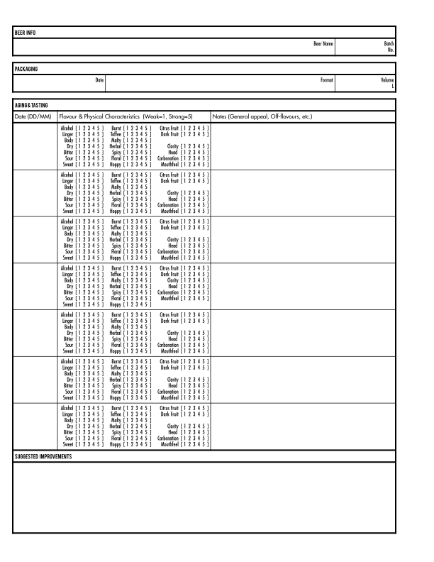

# Brewery Log

## Overview

A comprehensive log for BIAB (Brew in a Bag / Brew in a Basket) style brewing.

See the releases tab on GitHub for pre-generated PDFs.

## Preview

The log is presented in a clean, but asthetically pleasing manner. See for yourself:

### Cover

### BIAB

   

## How to Print

<dl>
  <dt>Paper Size</dt>
  <dd>US Letter</dd>
  <dt>Paper Composition</dt>
  <dd>Water-resistant (recommended)</dd>
  <dt>Printer Mode</dt>
  <dd>Duplex</dd>
  <dt>Binding</dt>
  <dd>Three-ring binder</dd>
</dl>

## Development

The source files are in "Flat ODT" XML format. LibreOffice Writer was used to create them, but in theory any ODT editor should be acceptable.

The following fonts are required:

- Fujiyama
- Fujiyama 2
- Bebas
