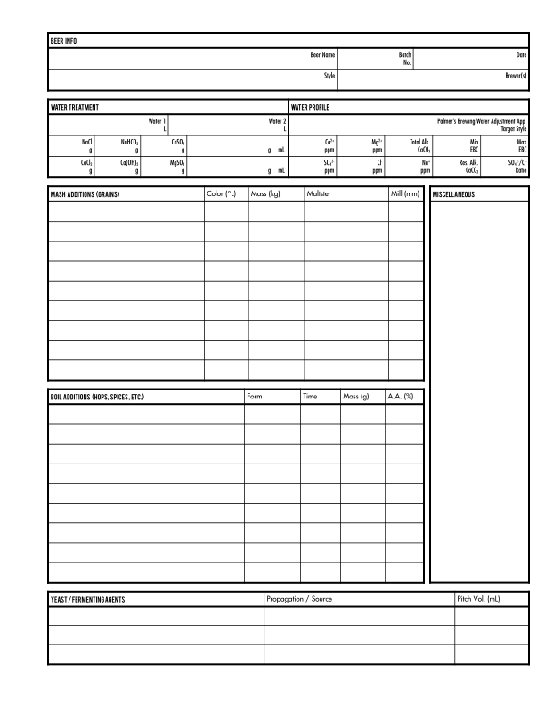
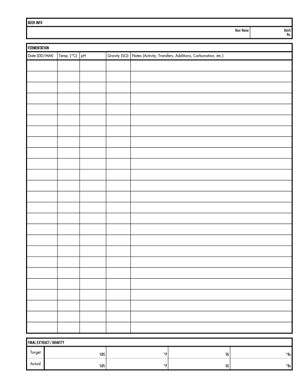

# Brewery Log

## Overview

A comprehensive log for BIAB (Brew in a Bag / Brew in a Basket) style brewing. Designed for use in a three-ring binder, for printing on US Letter paper.

Printing on water-resistant paper is recommended, but not required.

See the releases tab on GitHub for pre-generated PDFs.

## Preview

The log is presented in a clean, but asthetically pleasing manner. See for yourself:

### BIAB

   

## Development

The source files are in "Flat ODT" XML format. LibreOffice Writer was used to create them, but in theory any ODT editor should be acceptable.

The following fonts are required:

- Fujiyama
- Fujiyama 2
- Bebas
